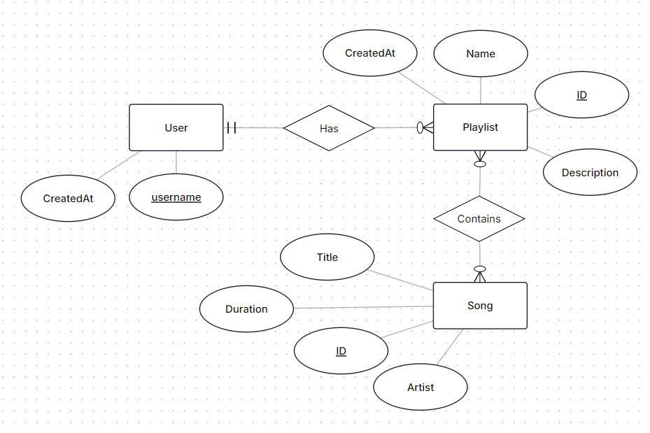
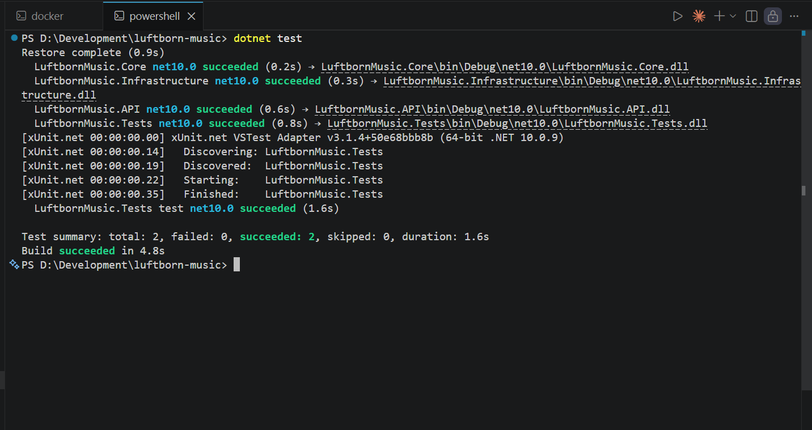
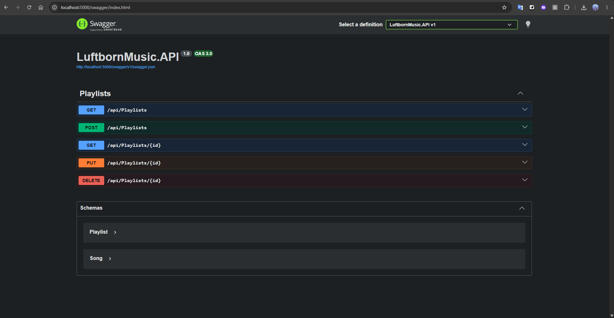

# LuftbornMusic — Luftborn Academy Backend Developer Test
---

## A Note to the Reviewer

Thanks for your time recruiter 😊

This is only my second time working with ASP.NET on an actual project. My everyday stack is Next.js, and I am also comfortable with Java and C. Taking on this challenge with a less familiar framework was genuinely fun — I hope I didn't mess it up too much. Have a great day!!!

### A Word on Design Patterns

I intentionally kept the design patterns minimal. I considered adding extra features just to justify throwing in more patterns, but every idea felt like forcing something in where it did not naturally belong. The Repository Pattern and Dependency Injection are already the right tools for this scope, so I settled on keeping the architecture clean rather than artificially complex.

---

## Table of Contents

1. [Installation & Execution Guide](#1-installation--execution-guide)
2. [Database Strategy: SQL over NoSQL](#2-database-strategy-sql-over-nosql)
3. [Database Schema Documentation](#3-database-schema-documentation)
4. [Architecture Overview](#4-architecture-overview)
5. [Proof of Execution & Testing](#5-proof-of-execution--testing)
6. [AI Interaction Log](#6-ai-interaction-log)

---

## 1. Installation & Execution Guide

The application is fully containerized. The recommended path requires only Docker Desktop. A local fallback using an in-memory database is also available if you prefer not to use Docker.

### Option A: Docker Setup (Recommended)

**Prerequisites:** [Docker Desktop](https://www.docker.com/products/docker-desktop/) installed and running.

1. Clone this repository and open a terminal at the root of the project (where `docker-compose.yml` lives).

2. Run the following command to spin up the PostgreSQL database container and build the API:

    ```bash
    docker compose up --build
    ```

3. Wait for the output to settle. The API is configured to automatically wait for the database to become healthy before starting, and it will apply all Entity Framework Core migrations automatically on startup — no manual database setup required.

4. Once the server is running, navigate to the Swagger UI to explore and test all endpoints:

    ```
    http://localhost:5000/swagger
    ```

> **Note on ports:** The `docker-compose.yml` maps the container's internal port `8080` to your machine's port `5000`. If port `5000` is already in use on your machine, edit the `ports` section of the `api` service in `docker-compose.yml` from `"5000:8080"` to another available port (e.g., `"5001:8080"`).

---

### Option B: Local In-Memory Setup (Backup / No Docker Required)

If you prefer to run the application without Docker, it can be switched to use an **Entity Framework Core In-Memory database** in seconds. No database installation is required.

**Steps:**

1. Open `LuftbornMusic.API/Program.cs`.

2. **Comment out** the PostgreSQL block and the auto-migration block:

    ```csharp
    // Comment these two out:
    // builder.Services.AddDbContext<AppDbContext>(options =>
    //     options.UseNpgsql(builder.Configuration.GetConnectionString("DefaultConnection")));

    // ...and also comment out this block near the bottom:
    // using (var scope = app.Services.CreateScope())
    // {
    //     var dbContext = scope.ServiceProvider.GetRequiredService<AppDbContext>();
    //     dbContext.Database.Migrate();
    // }
    ```

3. **Uncomment** the in-memory database block:

    ```csharp
    builder.Services.AddDbContext<AppDbContext>(options =>
        options.UseInMemoryDatabase("LuftbornMusicTestDb"));
    ```

4. Navigate into the API project folder and run:

    ```bash
    cd LuftbornMusic.API
    dotnet run
    ```

5. Navigate to the Swagger UI using the port shown in your terminal output (typically `http://localhost:5000/swagger` or similar).

> **Note:** The in-memory database is wiped every time the application restarts. It is intended for quick, stateless testing only.

---

## 2. Database Strategy: SQL over NoSQL

**Chosen Database:** PostgreSQL (via Entity Framework Core with the Npgsql provider)

The choice was straightforward for three reasons:

- **Highly relational data.** A playlist contains many songs, and a song can belong to many playlists — a classic Many-to-Many relationship that maps naturally to a SQL junction table. Forcing this into a document store means either duplicating data or managing manual references.
- **Data integrity.** With a normalised schema, a song exists exactly once in the `Songs` table. Updating its title or artist is a single-row operation that is immediately consistent everywhere. In a NoSQL document model, that same change requires a database-wide update across every playlist document that embeds it.
- **Stable, well-defined schema.** The fields of a `Song` and a `Playlist` are fixed and predictable. SQL's strict schema enforcement is a feature here, not a limitation — and EF Core handles all the `JOIN` logic and junction table management automatically.

---

## 3. Database Schema Documentation

The schema below is generated and managed by Entity Framework Core migrations. EF Core automatically creates a junction table (`PlaylistSong`) to represent the Many-to-Many relationship between playlists and songs.

### Table: `Playlists`

| Column Name   | Data Type   | Constraints / Notes          |
|---------------|-------------|------------------------------|
| `Id`          | `UUID`      | Primary Key                  |
| `Name`        | `VARCHAR`   | Not Null                     |
| `Description` | `VARCHAR`   | Nullable                     |
| `CreatedAt`   | `TIMESTAMP` | Default: UTC Now             |

### Table: `Songs`

| Column Name | Data Type  | Constraints / Notes |
|-------------|------------|---------------------|
| `Id`        | `UUID`     | Primary Key         |
| `Title`     | `VARCHAR`  | Not Null            |
| `Artist`    | `VARCHAR`  | Not Null            |
| `Duration`  | `INTERVAL` | Not Null            |

### Table: `PlaylistSong` (Junction / Bridge Table)

| Column Name   | Data Type | Constraints / Notes                     |
|---------------|-----------|-----------------------------------------|
| `PlaylistsId` | `UUID`    | Foreign Key → `Playlists.Id`            |
| `SongsId`     | `UUID`    | Foreign Key → `Songs.Id`               |
| *(composite)* | —         | Primary Key is (`PlaylistsId`, `SongsId`) |

### Entity Relationship Diagram


---

## 4. Architecture Overview

The solution is structured following **Clean Architecture (N-Tier)** principles, ensuring the core business logic has zero dependencies on any framework, database, or delivery mechanism.

The dependency flow is strictly one-directional:

```
API  →  Infrastructure  →  Core
```

`Core` knows nothing about anything else. `Infrastructure` knows about `Core`. `API` knows about both.

### Project Hierarchy

```
LuftbornMusic/
│
├── LuftbornMusic.Core/                    # Zero dependencies. The heart of the app.
│   ├── Entities/
│   │   ├── Playlist.cs                    # Playlist domain entity (Id, Name, Description, CreatedAt, Songs)
│   │   └── Song.cs                        # Song domain entity (Id, Title, Artist, Duration, Playlists)
│   └── Interfaces/
│       └── IPlaylistRepository.cs         # Contract: defines what operations a repository must support
│
├── LuftbornMusic.Infrastructure/          # Depends on Core. The database engine room.
│   ├── Data/
│   │   └── AppDbContext.cs                # EF Core DbContext; configures the Many-to-Many relationship
│   ├── Repositories/
│   │   └── PlaylistRepository.cs          # Concrete implementation of IPlaylistRepository using EF Core
│   └── Migrations/                        # Auto-generated SQL migration files (do not edit manually)
│
├── LuftbornMusic.API/                     # Depends on Core & Infrastructure. The HTTP front door.
│   ├── Controllers/
│   │   └── PlaylistsController.cs         # REST endpoints: GET all, GET by ID, POST, PUT, DELETE
│   ├── Program.cs                         # App bootstrap: DI registration, middleware pipeline, DB migration
│   └── appsettings.json                   # Connection strings and logging configuration
│
├── LuftbornMusic.Tests/                   # xUnit & Moq test suite. No infrastructure dependencies.
│   └── PlaylistsControllerTests.cs        # Unit tests for the controller using a mocked repository
│
├── Dockerfile                             # Multi-stage build: SDK for compile, ASP.NET runtime for execution
└── docker-compose.yml                     # Orchestrates the API container and the PostgreSQL container
```

### How the Layers Communicate

**Request lifecycle (example: `GET /api/playlists/{id}`):**

1. **HTTP Request** arrives at the `PlaylistsController` in the `API` layer.
2. The controller calls `_repository.GetByIdAsync(id)` on the injected `IPlaylistRepository` interface (from `Core`).
3. **ASP.NET's Dependency Injection container** resolves that interface to the concrete `PlaylistRepository` (from `Infrastructure`) at runtime.
4. `PlaylistRepository` uses `AppDbContext` (EF Core) to execute a SQL `SELECT ... JOIN ...` against PostgreSQL and eagerly load the related `Songs`.
5. The result travels back up through the layers and is serialized to JSON for the HTTP response.

The controller never knows which database is being used. The `Core` layer never knows a database exists at all. This is the key benefit of the Repository Pattern combined with Dependency Injection.

---

## 5. Proof of Execution & Testing

The project includes isolated unit tests built with **xUnit** and **Moq**. The tests validate the controller's logic in complete isolation — the real database and repository are replaced with a mock, confirming that the controller correctly honors the `IPlaylistRepository` contract and that Dependency Injection is wired up properly.

Two test cases are covered:

- `GetById_ReturnsOkResult_WhenPlaylistExists` — verifies that a `200 OK` response with the correct playlist is returned when the repository finds a match.
- `GetById_ReturnsNotFound_WhenPlaylistDoesNotExist` — verifies that a `404 Not Found` response is returned when the repository returns null.

### Test Results

> 

### Swagger UI

> 

---

## 6. AI Interaction Log

As per the deliverable requirements, the full development thought process, architectural decisions, troubleshooting sessions, and pair-programming log with AI are documented below:

https://gemini.google.com/share/342a3308cfdc

---
